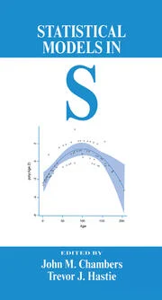

Adapted from "Chapter 7: Generalized Additive Models" by Trevor J. Hastie in *Statistical Models in S*, edited by John M. Chambers and Trevor J. Hastie (1992).

{height=300%}


**Changes**

- Used `Wage` data set instead of `market.survey` data set (not available)

- Rearranged by example data set to improve continuity

- Used `mgcv` package instead of `gam` package
    + `mgcv` `gam` conflicts with `gam` package
    + `gam` package doesn't play well with RMarkdown on Windows PC (?)
    + `mgcv` `gam` is used by `ggplot2` package

```{r, echo=TRUE, messages=TRUE, warning=TRUE}
knitr::opts_chunk$set(comment=NA, echo=TRUE, warning=TRUE, message=TRUE)

library(ggplot2)   # for "ggplot" function
library(gridExtra) # for "grid.arrange" function
#library(gam)
library(mgcv)      # for "gam" function used in this RMarkdown script
library(ISLR)      # for "Auto" and "Wage" data sets
library(rpart)     # for "car.test.frame" and "kyphosis" data sets
library(lattice)   # for "ethanol" data set
library(splines)   # for "ns" and "bs" functions
#library(plot3D)    # for function "persp3D"
```

## 1. Overview

Statistical Methods

Additive regression model: 

$\eta(X) = \alpha + f_1(x_1) + f_2(x_2) + ... + f_p(x_p)$

Examples:

- Simple Additive: 

$y = f(x) + \epsilon$
    
- Semiparametric: 

$y = X^t\beta + f(z) + \epsilon$
    
- Additive: 

$y = \beta^tX + f_1(z_1) + f_2(z_2) + ... + f_q(z_q) + \epsilon$

- Nonparametric logistic regression: 

$logit(P(X)) = log\left(\frac{P(X)}{1 - P(X)}\right) = \eta(X)$

"These **semiparametric models** have received attention in the analysis of agricultural field trials; the linear terms usually correspond to design effects and the nonlinear function models spatial ordering of the plots."

Data Analysis and Additive Models

```
ozone ~ wind + poly(temp, 3)
ozone ~ wind + s(temp)
```

Fitting Generalized Additive Models

- Scatterplot smoothers

- Backfitting algorithm

- Local-scoring algorithm

## 2. `car.test.frame` Data Set

S Functions and Objects

Fitting the Models

```{r, fig.width = 11, fig.height=5.5}
str(car.test.frame)

p1 <- ggplot(data = car.test.frame, aes(x = Weight, y = Mileage)) +
  geom_point() +
  geom_smooth(method = "lm", formula = y ~ x, se = FALSE, color = "red") +
  geom_smooth(method = "loess", formula = y ~ x, span = 0.75, se = FALSE) +
  labs(title = "gam(Mileage ~ lo(Weight))") +
  scale_y_continuous(limits = c(17.5, 37.5))

p2 <- ggplot(data = car.test.frame, aes(x = HP, y = Mileage)) +
  geom_point() +
  geom_smooth(method = "lm", formula = y ~ x, se = FALSE, color = "red") +
  geom_smooth(method = "gam", formula = y ~ s(x), se = FALSE) +
  labs(title = "gam(Mileage ~ s(HP))") +
  scale_y_continuous(limits = c(17.5, 37.5))

grid.arrange(p1, p2, ncol = 2, widths = c(5, 5))
```

**Figure 1:** Scatter smoothers summarize the relationship between the variable Mileage as a response and Weight and HP as predictors in the automobile data. The first panel uses the `loess()` smoother, while the second panel uses a smoothing spline. They can also be viewed as nonparametric estimates of the regression function for a simple additive model. The straight line in each case is the least-squares linear fit.

```{r}
Mileage.lm <- lm(Mileage ~ Weight, data = car.test.frame)
summary(Mileage.lm)
(rss0 <- sum(Mileage.lm$residuals^2))
(df0 <- summary(Mileage.lm)$df[1])

Mileage.lo <- loess(Mileage ~ Weight, span = 0.75, data = car.test.frame)
summary(Mileage.lo)
(rss1 <- sum(Mileage.lo$residuals^2))
(df1 <- summary(Mileage.lo)$enp)

(n <- dim(car.test.frame)[1])

approxF <- function(RSS0, DF0, RSS1, DF1, N) {
  Fstat <- ((RSS0 - RSS1)/(DF1 - DF0))/(RSS1/(N - DF1)) 
  return(Fstat)
}

(Fstat <- approxF(rss0, df0, rss1, df1, n))
1 - pf(Fstat, df1 - df0, n - df1)

summary(loess(Mileage ~ Weight, span = 1/2, data = car.test.frame))
summary(loess(Mileage ~ Weight, span = 1/3, data = car.test.frame))

summary(gam(Mileage ~ s(HP), data = car.test.frame))
```

```{r, fig.width=11, fig.height=5.5}
auto.add <- gam(Mileage ~ s(Weight) + s(HP), data = car.test.frame)
summary(auto.add)

par(mfrow = c(1, 2))
plot(auto.add)
```

**Figure 2:** An additive model relates Mileage to Weight and HP. Each plot is the contribution of a term to the additive predictor, and has "y" label the expression used to specify it in the model formula. Each curve has been centered to have average 0. The effect of HP in this joint fit is greatly reduced from that in **Figure 1**.

```{r}
summary(gam(Mileage ~ s(Weight), data = car.test.frame))
```

Reproduce **Figure 1** on log-log scale to see if that linearizes it and F stat is not significant

```{r, fig.width = 11, fig.height=5.5}
p1 <- ggplot(data = car.test.frame, aes(x = log(Weight), y = log(Mileage))) +
  geom_point() +
  geom_smooth(method = "lm", formula = y ~ x, se = FALSE, color = "red") +
  geom_smooth(method = "loess", formula = y ~ x, span = 0.75, se = FALSE) +
  labs(title = "gam(log(Mileage) ~ lo(log(Weight)))") +
  scale_y_continuous(limits = c(2.85, 3.65))

p2 <- ggplot(data = car.test.frame, aes(x = log(HP), y = log(Mileage))) +
  geom_point() +
  geom_smooth(method = "lm", formula = y ~ x, se = FALSE, color = "red") +
  geom_smooth(method = "gam", formula = y ~ s(x), se = FALSE) +
  labs(title = "gam(log(Mileage) ~ s(log(HP)))") +
  scale_y_continuous(limits = c(2.85, 3.65))

grid.arrange(p1, p2, ncol = 2, widths = c(5, 5))
```

**Figure 3:** Scatter smoothers summarize the relationship between the variable Mileage as a response and Weight and HP as predictors in the automobile data on log-log scale. The first panel uses the `loess()` smoother, while the second panel uses a smoothing spline. They can also be viewed as nonparametric estimates of the regression function for a simple additive model. The straight line in each case is the least-squares linear fit.

```{r}
Mileage.lm <- lm(log(Mileage) ~ log(Weight), data = car.test.frame)
summary(Mileage.lm)
(rss0 <- sum(Mileage.lm$residuals^2))
(df0 <- summary(Mileage.lm)$df[1])

Mileage.lo <- loess(log(Mileage) ~ log(Weight), span = 0.75, data = car.test.frame)
summary(Mileage.lo)
(rss1 <- sum(Mileage.lo$residuals^2))
(df1 <- summary(Mileage.lo)$enp)

(n <- dim(car.test.frame)[1])

(Fstat <- approxF(rss0, df0, rss1, df1, n))
1 - pf(Fstat, df1 - df0, n - df1)
```

## 3. `Wage` Data Set

Data from *An Introduction to Statistical Learning with Applications in R* by Gareth James, Daniela Witten, Trevor Hastie and Robert Tibshirani

```{r, fig.width=5.5, fig.height=5.5}
str(Wage)

fit <- gam(I(wage > 250) ~ s(age, k = 6), data = Wage, family = binomial)
summary(fit)

with(Wage, plot(age, wage > 250, type = "n", ylim = c(0, 0.05)))
with(Wage, points (jitter(age), I((wage > 250)/20), cex = 0.5, pch ="|", col = "grey"))
o <- order(Wage$age)
lines(Wage$age[o], fitted(fit)[o])
```

**Figure 4:** A scatterplot smooth for binary data (jittered to break ties). The smooth estimates the proportion of survey respondents making over $250K per year as function of age.

```{r, fig.width=11, fig.height=5.5}
fit <- gam(I(wage > 250) ~ s(log(age), k = 6), data = Wage, family = binomial)
summary(fit)

par(mfrow = c(1, 2))
with(Wage, plot(log(age), wage > 250, type = "n", ylim = c(0, 0.05)))
with(Wage, points (jitter(log(age)), I((wage > 250)/20), cex = 0.5, pch ="|", col = "grey"))
o <- order(Wage$age)
lines(log(Wage$age[o]), fitted(fit)[o])

with(Wage, plot(age, wage > 250, type = "n", ylim = c(0, 0.05)))
with(Wage, points (jitter(age), I((wage > 250)/20), cex = 0.5, pch ="|", col = "grey"))
o <- order(Wage$age)
lines(Wage$age[o], fitted(fit)[o])
```

**Figure 5:** The left figure smooths Wage > 250 against the transformed log(age). The right figure plots the same fit against the untransformed usage.

Specializing and Extending the Computations

Stepwise Model Selection

*If I were to be treated by a cure created by stepwise regression, I would prefer voodoo.* - Dieter Menne (in a thread about regressions with many variables) R-help (October 2009)]

https://stat.ethz.ch/R-manual/R-devel/library/mgcv/html/step.gam.html

**step.gam {mgcv}	R Documentation**

*Alternatives to step.gam*

*Description*

*There is no step.gam in package mgcv. The mgcv default for model selection is to use either prediction error criteria such as GCV, GACV, Mallows' Cp/AIC/UBRE or the likelihood based methods of REML or ML. Since the smoothness estimation part of model selection is done in this way it is logically most consistent to perform the rest of model selection in the same way. i.e. to decide which terms to include or omit by looking at changes in GCV, AIC, REML etc.*

```{r, fig.width=11, fig.height=5.5}
# an example of GCV based model selection as an alternative to stepwise selection, 
# using shrinkage smoothers...

# Note the increased gamma parameter below to favour slightly smoother models...
wage.fit <- gam(
  I(wage > 250) ~ year + s(age, bs = "ts") + maritl + race + education +  jobclass + health + health_ins, 
  data = Wage, 
  gamma = 1.4
)

summary(wage.fit)

# Same again using REML/ML
wage.fit2 <- gam(
  I(wage > 250) ~ year + s(age, bs = "ts") + maritl + race + education + jobclass + health + health_ins, 
  data = Wage, 
  method = "REML"
)

summary(wage.fit2)

# And once more, but using the null space penalization
wage.fit3 <- gam(
  I(wage > 250) ~ year + s(age, bs = "cr") + maritl + race + education + jobclass + health + health_ins, 
  data = Wage, 
  method = "REML", 
  select = TRUE
)

summary(wage.fit3)

# Recode to remove insignifant levels of factors
Wage$Married <- as.factor(ifelse(Wage$maritl == "2. Married", "Yes", "No"))
Wage$Degree  <- rep("1. No", length(Wage$education))
Wage$Degree  <- ifelse(Wage$education == "4. College Grad", "2. College Grad", Wage$Degree)
Wage$Degree  <- ifelse(Wage$education == "5. Advanced Degree", "3. Advanced Degree", Wage$Degree)
Wage$Degree  <- as.factor(Wage$Degree)

# Reduced model
wage.fit4 <- gam(
  I(wage > 250) ~ s(age, bs = "ad") + Married + Degree + jobclass, 
  data = Wage, 
  method = "REML", 
  select = TRUE
)

summary(wage.fit4)

par(mfrow = c(1, 2))
termplot(wage.fit4, se = TRUE)
plot(wage.fit4)
```

**Figure 6:** Term plots for categorical inputs and spline fit for age for the model manually derived by removing insignificant terms and insignificant levels within terms.

Plotting the Fitted Models

```{r, fig.width=11, fig.height=5.5}
fit2 <- gam(
  I(wage > 250) ~ s(age, k = 6) + education, data = Wage, family = binomial, 
  subset = (education != "1. < HS Grad")
)

summary(fit2)

fit3 <- gam(
  I(wage > 250) ~ log(age) + education, 
  data = Wage, 
  family = binomial, 
  subset = (education != "1. < HS Grad")
)

summary(fit3)

par(mfrow = c(1, 2))

plot(fit2)
termplot(fit2, term = 2, se = TRUE)

termplot(fit3, term = 1, se = TRUE)
termplot(fit3, term = 2, se = TRUE)
```

**Figure 7:** Representations of some additive fits to the Wage data. The top row was created by the expression `plot(fit2)` and `termplot(fit2, term = 2, se = TRUE)`. The x-axis in each plot is labeled according to the "inner" predictor in the term, such as `I(wage > 250)` in the term `s(age)`; the y-axis is labeled by the term label itself. The bottom row is a plot of the GAM model `gam(I(wage > 250) ~ log(age) + education, binomial)`, using a similar call to the function `plot.gam()`.

## 4. `kyphosis` Data Set

```{r, fig.width=11, fig.height=3.66}
str(kyphosis)

# default df = 4, so use k = 5
kyph.gam1 <- gam(
  Kyphosis ~ s(Age, k = 5) + s(Number, k = 5) + s(Start, k = 5), 
  family = binomial, 
  data = kyphosis
)

par(mfrow = c(1, 3))
plot(kyph.gam1, residuals = TRUE, rug = FALSE)
```

**Figure 8:** A graphical description of the generalized additive model fit of the binary response Kyphosis to three predictors. The figures are plotted on the logit scale, and each plot represents the contribution of that variable to the fitted logit. Included in each of the plots are partial residuals for that variable.

```{r, fig.width=8.5, fig.height=8.5}
summary(kyph.gam1)

cols <- rep("", length(kyphosis$Kyphosis))
cols[kyphosis$Kyphosis == "absent"] <- "green"
cols[kyphosis$Kyphosis == "present"] <- "red"
pairs(kyphosis[, 2:4], col = cols)
```

**Figure 9:** A scatterplot matrix of the three predictors in the Kyphosis data. The presence (solid dots) and absence (hallow circles) of Kyphosis is indicated in the plots.

```{r, fig.width=11, fig.height=5.5}
kyph.gam2 <- update(kyph.gam1, ~ . - s(Number, k = 5), family = binomial, data = kyphosis)
summary(kyph.gam2)

par(mfrow = c(1, 2))
plot(kyph.gam2, se = TRUE)
```

**Figure 10:** The additive logistics fit of Kyphosis to Age and Start. The dashed curves are pointwise 2*standard-error bands.

```{r}
anova(kyph.gam1, kyph.gam2, test = "Chisq")
```

```
predict.gam(gamob, new.data, type = "terms")
```

```{r, fig.width=8.5, fig.height=8.5}
formula(kyph.gam2)

kyph.margin <- with(
  kyphosis, 
  data.frame(
    Age = seq(from = min(Age), to = max(Age), len = 40),
    Start = seq(from = min(Start), to = max(Start), len = 40)
  )
)

margin.fit <- predict(kyph.gam2, kyph.margin, type = "terms")

kyph.surf <- outer(margin.fit[ , 1], margin.fit[ , 2], "+")
kyph.surf <- kyph.surf + attr(margin.fit, "constant")
#kyph.surf <- binomial()$inverse(kyph.surf) # S/S-Plus function not available in R?

binomialInv <- function(x) {
  A <- exp(x)
  result <- A/(1 + A)
  result
}

kyph.surf <- binomialInv(kyph.surf)

with(kyphosis, plot(Age, Start, type = "n"))
with(kyphosis, points(Age[Kyphosis == "absent"], Start[Kyphosis == "absent"]))
with(kyphosis, points(Age[Kyphosis == "present"], Start[Kyphosis == "present"], pch = 19))
contour(kyph.margin$Age, kyph.margin$Start, kyph.surf, add = TRUE, levels = c(0.1, 0.3, 0.5))
```

**Figure 11:** A contour plot of the fitted probability surface derived from the fitted additive model `kyph.gam2`. The black dots indicate cases with Kyphosis present, the circles, absent.

Further Details on `gam()`

```{r}
names(kyph.gam1)
class(kyph.gam1)
```

## 5. `enthanol` Data Set

Parametric Additive Models: `bs()` and `ns()`

```{r, fig.width=11, fig.height=5.5}
data(ethanol)
str(ethanol)

gas.ns <- lm(NOx ~ ns(E, knots = c(0.7, 0.93, 1.1)), data = ethanol)
summary(gas.ns)

gas.bs1 <- lm(NOx ~ bs(E, knots = 0.93), data = ethanol)
summary(gas.bs1)

gas.bs2 <- lm(NOx ~ bs(E, knots = 0.93, degree = 1), data = ethanol)
summary(gas.bs2)

anova(gas.ns, gas.bs1, gas.bs2)

par(mfrow = c(1, 2))
with(ethanol, plot(E, NOx))
o <- order(ethanol$E)
lines(ethanol$E[o], fitted(gas.bs1)[o])
abline(v = 0.93, col = "grey")
with(ethanol, plot(E, NOx))
lines(ethanol$E[o], fitted(gas.bs2)[o])
abline(v = 0.93, col = "grey")
```

**Figure 12:** A demonstration of B-spline functions using `bs()`. The y-labels show the term used in a call to `lm()`; the functions were plotted using `plot.gam()`. The dotted vertical lines are included to show the placement of the single knot.

```{r, fig.width=5.5, fig.height=5.5}
with(ethanol, plot(E, NOx, ylim = c(0, 5)))
o <- order(ethanol$E)
lines(ethanol$E[o], fitted(gas.ns)[o])
abline(v = 0.70, col = "grey")
abline(v = 0.93, col = "grey")
abline(v = 1.10, col = "grey")
s <- summary(gas.ns)$sigma
lines(ethanol$E[o], fitted(gas.ns)[o] - 2*s, lty = 2)
lines(ethanol$E[o], fitted(gas.ns)[o] + 2*s, lty = 2)
```

**Figure 13:** A demonstration of a natural cubic B-spline using `ns()`. The vertical lines indicate the placement of knots. The upper and lower curves are pointwise twice standard-error bands.

An Example in Detail

```{r, fig.width=11, fig.height=5.5}
eth1 <- gam(NOx ~ C + s(E, k = 3), data = ethanol)
summary(eth1)

par(mfrow = c(1, 2))
with(ethanol, plot(C, NOx))
with(ethanol, plot(E, NOx))

termplot(eth1, ylim = c(-3, 2))
plot(eth1, residuals = TRUE, se = TRUE, rug = FALSE, ylim = c(-3, 2))
```

**Figure 14:** The top row shows NOx plotted against C, the combustion level, and E, the equivalence ratio for the ethanol data. The bottom row shows an additive model fit, where C is modeled and E is modeled by a locally quadratic smooth term, specified by `lo(E, degree = 2)`.

```{r}
eth2 <- update(eth1, ~ . - C)
summary(eth2)

eth3 <- gam(NOx ~ s(C, k = 3) + s(E, k = 13), data = ethanol)
summary(eth3)

aov1 <- anova(eth2, eth1, eth3, test = "F")
aov1
```

```{r, fig.width=11, fig.height=5.5}
par(mfrow = c(1, 2))
plot(eth3)
```

```{r, fig.width=11, fig.height=5.5, }
vis.gam(eth3, theta = 315, phi = 20, ticktype = "detailed", expand = 0.375)
```

**Figure 15:** A perspective plot of the bivariate surface smooth term in the model `eth3`, produced by the `viz.gam()` function for gam objects.

```{r, fig.width=11, fig.height=5.5}
E.int <- co.intervals(ethanol$E, number = 3, overlap = 0.1)
ethanol$resid <- residuals(eth1)
coplot(
  resid ~ C|E, data = ethanol, 
  given = E.int, 
  rows = 1, 
  panel = function(x, y, ...) panel.smooth(x, y, span = 1.0, ...)
)
```

**Figure 16:** A `coplot()` shows the residuals from the additive model fit plotted against c, given three different overlapping intervals of the values of E. The interaction structure is evident.

```{r, fig.width=11, fig.height=5.5}
eth4 <- glm(NOx ~ C + cut(E, 7), data = ethanol)
summary(eth4)

par(mfrow = c(1, 2))
termplot(eth4, partial.resid = TRUE, rug = FALSE, se = TRUE)
```

**Figure 17:** A plot of the terms in the parametric model `glm(NOx ~ C + cut(E, 7))`, with pointwise twice standard-error bands and partial residuals. The `plot.gam()` method represents a categorical transformation of a quantitative predictor as a piecewise constant function.

```{r, fig.width=5.5, fig.height=5.5}
eth5 <- glm(NOx ~ C*cut(E, 7), data = ethanol)
summary(eth5)

anova(eth4, eth5, test = "F")

eth6 <- gam(NOx ~ s(E, k = 7, by = C), data = ethanol)
summary(eth6)

anova(eth4, eth5, eth6, test = "Cp")

plot(eth6)
```

```{r, fig.width=8.5, fig.height=8.5}
ethanol$fit <- fitted(eth6)

ggplot(data = ethanol, aes(x = E, y = NOx)) +
  geom_point() +
  geom_smooth(data = ethanol, aes(x = E, y = fit), method = "loess", span = 1) +
  facet_wrap(~ C, ncol = 3) +
  scale_y_continuous(lim = c(0, 5))
```

Missing Data: Prediction

```
predict.gam(gamob, type = "response")

fitted(gamob)
```

```{r, fig.with=11, fig.height=5.5}
formula(eth3)

new.eth <- with(
  ethanol, 
  expand.grid(
    C = seq(from = min(C), to = max(C), len = 40),
    E = seq(from = min(E), to = max(E), len = 40)
  )
)

eth.grid <- predict(eth3, new.eth)

C <- with(ethanol, seq(from = min(C), to = max(C), len = 40))
E <- with(ethanol, seq(from = min(E), to = max(E), len = 40))
NOx <- matrix(eth.grid, nrow = 40, ncol = 40)

persp(C, E, NOx, theta = 315, phi = 20, ticktype = "detailed", expand = 0.375)
#persp3D(C, E, NOx, theta = 315, phi = 20, ticktype = "detailed", expand = 0.375, 
#        xlab = "C", ylab = "E", zlab = "NOx")
```

**Figure 18:** The fitted surface corresponding to `eth3`, evaluated on a 40 x 40 grid of values of C and E using `predict()`. Compare to **Figure 15**.

More on Plotting

```{r, fig.width=11, fig.height=5.5}
eth7 <- lm(NOx ~ C + ns(E, 5), data = ethanol)
summary(eth7)

eth8 <- lm(NOx ~ I(C - mean(C)) + ns(I(E - mean(E)), 5), data = ethanol) # Centered
summary(eth8)

par(mfrow = c(1, 2))
termplot(eth7, se = TRUE, main = "Not Centered")
termplot(eth8, se = TRUE, main = "Centered")
```

**Figure 19:** The plot on the top row shows the uncentered, fitted term for C in the model eth7, together with pointwise 2*standard-error bands. The plot on the bottom row is the centered version (no difference from uncentered version).

## `airquality` Data Set

Numerical and Computational Details

Scatterplot Smoothing

Fitting Simple Additive Models

```{r}
data(airquality)
str(airquality)

#gam.control(trace = TRUE) 
ozone.gam <- gam(
  log(Ozone) ~ s(Solar.R, bs = "ts") + s(Wind, bs = "ts") + s(Temp, bs = "ts"), 
  data = airquality, 
  trace = TRUE
)

summary(ozone.gam)
```

```{r, fig.width=11, fig.height=3.66}
par(mfrow = c(1, 3))
plot(ozone.gam)
```

**Figure 20:** The solid curves represent the additive model fit to ozone using there atmospheric variables. The points in the figures represent the partial residuals (fitted function + overall residuals). The broken curves show the functions obtained by smoothing the variables separately against log(ozone).
