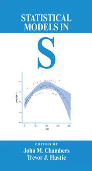

Generalized Additive Models Tutorial
================
Robert A. Stevens
2023-11-29

Adapted from “Chapter 7: Generalized Additive Models” by Trevor J.
Hastie in *Statistical Models in S*, edited by John M. Chambers and
Trevor J. Hastie (1992).



**Changes**

-   Used `Wage` data set instead of `market.survey` data set (not
    available)

-   Rearranged by example data set to improve continuity

-   Used `mgcv` package instead of `gam` package

    -   `mgcv` `gam` conflicts with `gam` package
    -   `gam` package doesn’t play well with RMarkdown on Windows PC (?)
    -   `mgcv` `gam` is used by `ggplot2` package

``` r
knitr::opts_chunk$set(comment=NA, echo=TRUE, warning=TRUE, message=TRUE)

library(ggplot2)   # for "ggplot" function
library(gridExtra) # for "grid.arrange" function
#library(gam)
library(mgcv)      # for "gam" function used in this RMarkdown script
```

    ## Loading required package: nlme

    ## This is mgcv 1.8-38. For overview type 'help("mgcv-package")'.

``` r
library(ISLR)      # for "Auto" and "Wage" data sets
library(rpart)     # for "car.test.frame" and "kyphosis" data sets
library(lattice)   # for "ethanol" data set
library(splines)   # for "ns" and "bs" functions
#library(plot3D)    # for function "persp3D"
```

## 1. Overview

Statistical Methods

Additive regression model:

 = \alpha + f_1(x_1) + f_2(x_2) + ... + f_p(x_p)")

Examples:

-   Simple Additive:

 + \epsilon")

-   Semiparametric:

 + \epsilon")

-   Additive:

 + f_2(z_2) + ... + f_q(z_q) + \epsilon")

-   Nonparametric logistic regression:

) = log\left(\frac{P(X)}{1 - P(X)}\right) = \eta(X)")

“These **semiparametric models** have received attention in the analysis
of agricultural field trials; the linear terms usually correspond to
design effects and the nonlinear function models spatial ordering of the
plots.”

Data Analysis and Additive Models

    ozone ~ wind + poly(temp, 3)
    ozone ~ wind + s(temp)

Fitting Generalized Additive Models

-   Scatterplot smoothers

-   Backfitting algorithm

-   Local-scoring algorithm

## 2. `car.test.frame` Data Set

S Functions and Objects

Fitting the Models

``` r
str(car.test.frame)
```

    'data.frame':   60 obs. of  8 variables:
     $ Price      : int  8895 7402 6319 6635 6599 8672 7399 7254 9599 5866 ...
     $ Country    : Factor w/ 8 levels "France","Germany",..: 8 8 5 4 3 6 4 5 3 3 ...
     $ Reliability: int  4 2 4 5 5 4 5 1 5 NA ...
     $ Mileage    : int  33 33 37 32 32 26 33 28 25 34 ...
     $ Type       : Factor w/ 6 levels "Compact","Large",..: 4 4 4 4 4 4 4 4 4 4 ...
     $ Weight     : int  2560 2345 1845 2260 2440 2285 2275 2350 2295 1900 ...
     $ Disp.      : int  97 114 81 91 113 97 97 98 109 73 ...
     $ HP         : int  113 90 63 92 103 82 90 74 90 73 ...

``` r
p1 <- ggplot(data = car.test.frame, aes(x = Weight, y = Mileage)) +
  geom_point() +
  geom_smooth(method = "lm", formula = y ~ x, se = FALSE, color = "red") +
  geom_smooth(method = "loess", formula = y ~ x, span = 0.75, se = FALSE) +
  labs(title = "gam(Mileage ~ lo(Weight))") +
  scale_y_continuous(limits = c(17.5, 37.5))

p2 <- ggplot(data = car.test.frame, aes(x = HP, y = Mileage)) +
  geom_point() +
  geom_smooth(method = "lm", formula = y ~ x, se = FALSE, color = "red") +
  geom_smooth(method = "gam", formula = y ~ s(x), se = FALSE) +
  labs(title = "gam(Mileage ~ s(HP))") +
  scale_y_continuous(limits = c(17.5, 37.5))

grid.arrange(p1, p2, ncol = 2, widths = c(5, 5))
```

    Warning: Removed 4 rows containing missing values (geom_smooth).

    Warning: Removed 17 rows containing missing values (geom_smooth).

<!-- -->

**Figure 1:** Scatter smoothers summarize the relationship between the
variable Mileage as a response and Weight and HP as predictors in the
automobile data. The first panel uses the `loess()` smoother, while the
second panel uses a smoothing spline. They can also be viewed as
nonparametric estimates of the regression function for a simple additive
model. The straight line in each case is the least-squares linear fit.

``` r
Mileage.lm <- lm(Mileage ~ Weight, data = car.test.frame)
summary(Mileage.lm)
```


    Call:
    lm(formula = Mileage ~ Weight, data = car.test.frame)

    Residuals:
        Min      1Q  Median      3Q     Max 
    -4.6962 -1.7396 -0.1733  1.8978  5.6243 

    Coefficients:
                  Estimate Std. Error t value Pr(>|t|)    
    (Intercept) 48.3493466  1.9794137   24.43   <2e-16 ***
    Weight      -0.0081928  0.0006728  -12.18   <2e-16 ***
    ---
    Signif. codes:  0 '***' 0.001 '**' 0.01 '*' 0.05 '.' 0.1 ' ' 1

    Residual standard error: 2.562 on 58 degrees of freedom
    Multiple R-squared:  0.7189,    Adjusted R-squared:  0.714 
    F-statistic: 148.3 on 1 and 58 DF,  p-value: < 2.2e-16

``` r
(rss0 <- sum(Mileage.lm$residuals^2))
```

    [1] 380.8322

``` r
(df0 <- summary(Mileage.lm)$df[1])
```

    [1] 2

``` r
Mileage.lo <- loess(Mileage ~ Weight, span = 0.75, data = car.test.frame)
summary(Mileage.lo)
```

    Call:
    loess(formula = Mileage ~ Weight, data = car.test.frame, span = 0.75)

    Number of Observations: 60 
    Equivalent Number of Parameters: 4.86 
    Residual Standard Error: 2.423 
    Trace of smoother matrix: 5.33  (exact)

    Control settings:
      span     :  0.75 
      degree   :  2 
      family   :  gaussian
      surface  :  interpolate     cell = 0.2
      normalize:  TRUE
     parametric:  FALSE
    drop.square:  FALSE 

``` r
(rss1 <- sum(Mileage.lo$residuals^2))
```

    [1] 318.3162

``` r
(df1 <- summary(Mileage.lo)$enp)
```

    [1] 4.863592

``` r
(n <- dim(car.test.frame)[1])
```

    [1] 60

``` r
approxF <- function(RSS0, DF0, RSS1, DF1, N) {
  Fstat <- ((RSS0 - RSS1)/(DF1 - DF0))/(RSS1/(N - DF1)) 
  return(Fstat)
}

(Fstat <- approxF(rss0, df0, rss1, df1, n))
```

    [1] 3.78146

``` r
1 - pf(Fstat, df1 - df0, n - df1)
```

    [1] 0.01672487

``` r
summary(loess(Mileage ~ Weight, span = 1/2, data = car.test.frame))
```

    Call:
    loess(formula = Mileage ~ Weight, data = car.test.frame, span = 1/2)

    Number of Observations: 60 
    Equivalent Number of Parameters: 6.86 
    Residual Standard Error: 2.426 
    Trace of smoother matrix: 7.57  (exact)

    Control settings:
      span     :  0.5 
      degree   :  2 
      family   :  gaussian
      surface  :  interpolate     cell = 0.2
      normalize:  TRUE
     parametric:  FALSE
    drop.square:  FALSE 

``` r
summary(loess(Mileage ~ Weight, span = 1/3, data = car.test.frame))
```

    Call:
    loess(formula = Mileage ~ Weight, data = car.test.frame, span = 1/3)

    Number of Observations: 60 
    Equivalent Number of Parameters: 9.59 
    Residual Standard Error: 2.463 
    Trace of smoother matrix: 10.6  (exact)

    Control settings:
      span     :  0.3333333 
      degree   :  2 
      family   :  gaussian
      surface  :  interpolate     cell = 0.2
      normalize:  TRUE
     parametric:  FALSE
    drop.square:  FALSE 

``` r
summary(gam(Mileage ~ s(HP), data = car.test.frame))
```


    Family: gaussian 
    Link function: identity 

    Formula:
    Mileage ~ s(HP)

    Parametric coefficients:
                Estimate Std. Error t value Pr(>|t|)    
    (Intercept)  24.5833     0.4348   56.54   <2e-16 ***
    ---
    Signif. codes:  0 '***' 0.001 '**' 0.01 '*' 0.05 '.' 0.1 ' ' 1

    Approximate significance of smooth terms:
            edf Ref.df     F p-value    
    s(HP) 2.382  3.015 20.13  <2e-16 ***
    ---
    Signif. codes:  0 '***' 0.001 '**' 0.01 '*' 0.05 '.' 0.1 ' ' 1

    R-sq.(adj) =  0.506   Deviance explained = 52.6%
    GCV = 12.021  Scale est. = 11.344    n = 60

``` r
auto.add <- gam(Mileage ~ s(Weight) + s(HP), data = car.test.frame)
summary(auto.add)
```


    Family: gaussian 
    Link function: identity 

    Formula:
    Mileage ~ s(Weight) + s(HP)

    Parametric coefficients:
                Estimate Std. Error t value Pr(>|t|)    
    (Intercept)    24.58       0.31   79.29   <2e-16 ***
    ---
    Signif. codes:  0 '***' 0.001 '**' 0.01 '*' 0.05 '.' 0.1 ' ' 1

    Approximate significance of smooth terms:
                edf Ref.df     F p-value    
    s(Weight) 2.225  2.797 25.47  <2e-16 ***
    s(HP)     1.000  1.000  0.00   0.985    
    ---
    Signif. codes:  0 '***' 0.001 '**' 0.01 '*' 0.05 '.' 0.1 ' ' 1

    R-sq.(adj) =  0.749   Deviance explained = 76.3%
    GCV =  6.204  Scale est. = 5.7672    n = 60

``` r
par(mfrow = c(1, 2))
plot(auto.add)
```

<!-- -->

**Figure 2:** An additive model relates Mileage to Weight and HP. Each
plot is the contribution of a term to the additive predictor, and has
“y” label the expression used to specify it in the model formula. Each
curve has been centered to have average 0. The effect of HP in this
joint fit is greatly reduced from that in **Figure 1**.

``` r
summary(gam(Mileage ~ s(Weight), data = car.test.frame))
```


    Family: gaussian 
    Link function: identity 

    Formula:
    Mileage ~ s(Weight)

    Parametric coefficients:
                Estimate Std. Error t value Pr(>|t|)    
    (Intercept)  24.5833     0.3074   79.98   <2e-16 ***
    ---
    Signif. codes:  0 '***' 0.001 '**' 0.01 '*' 0.05 '.' 0.1 ' ' 1

    Approximate significance of smooth terms:
                edf Ref.df     F p-value    
    s(Weight) 2.244  2.822 63.79  <2e-16 ***
    ---
    Signif. codes:  0 '***' 0.001 '**' 0.01 '*' 0.05 '.' 0.1 ' ' 1

    R-sq.(adj) =  0.753   Deviance explained = 76.2%
    GCV =  5.993  Scale est. = 5.669     n = 60

Reproduce **Figure 1** on log-log scale to see if that linearizes it and
F stat is not significant

``` r
p1 <- ggplot(data = car.test.frame, aes(x = log(Weight), y = log(Mileage))) +
  geom_point() +
  geom_smooth(method = "lm", formula = y ~ x, se = FALSE, color = "red") +
  geom_smooth(method = "loess", formula = y ~ x, span = 0.75, se = FALSE) +
  labs(title = "gam(log(Mileage) ~ lo(log(Weight)))") +
  scale_y_continuous(limits = c(2.85, 3.65))

p2 <- ggplot(data = car.test.frame, aes(x = log(HP), y = log(Mileage))) +
  geom_point() +
  geom_smooth(method = "lm", formula = y ~ x, se = FALSE, color = "red") +
  geom_smooth(method = "gam", formula = y ~ s(x), se = FALSE) +
  labs(title = "gam(log(Mileage) ~ s(log(HP)))") +
  scale_y_continuous(limits = c(2.85, 3.65))

grid.arrange(p1, p2, ncol = 2, widths = c(5, 5))
```

    Warning: Removed 1 rows containing missing values (geom_smooth).

<!-- -->

**Figure 3:** Scatter smoothers summarize the relationship between the
variable Mileage as a response and Weight and HP as predictors in the
automobile data on log-log scale. The first panel uses the `loess()`
smoother, while the second panel uses a smoothing spline. They can also
be viewed as nonparametric estimates of the regression function for a
simple additive model. The straight line in each case is the
least-squares linear fit.

``` r
Mileage.lm <- lm(log(Mileage) ~ log(Weight), data = car.test.frame)
summary(Mileage.lm)
```


    Call:
    lm(formula = log(Mileage) ~ log(Weight), data = car.test.frame)

    Residuals:
          Min        1Q    Median        3Q       Max 
    -0.190882 -0.057626 -0.004132  0.069451  0.210090 

    Coefficients:
                Estimate Std. Error t value Pr(>|t|)    
    (Intercept) 10.55275    0.55204   19.12   <2e-16 ***
    log(Weight) -0.92591    0.06935  -13.35   <2e-16 ***
    ---
    Signif. codes:  0 '***' 0.001 '**' 0.01 '*' 0.05 '.' 0.1 ' ' 1

    Residual standard error: 0.09351 on 58 degrees of freedom
    Multiple R-squared:  0.7545,    Adjusted R-squared:  0.7503 
    F-statistic: 178.2 on 1 and 58 DF,  p-value: < 2.2e-16

``` r
(rss0 <- sum(Mileage.lm$residuals^2))
```

    [1] 0.5071697

``` r
(df0 <- summary(Mileage.lm)$df[1])
```

    [1] 2

``` r
Mileage.lo <- loess(log(Mileage) ~ log(Weight), span = 0.75, data = car.test.frame)
summary(Mileage.lo)
```

    Call:
    loess(formula = log(Mileage) ~ log(Weight), data = car.test.frame, 
        span = 0.75)

    Number of Observations: 60 
    Equivalent Number of Parameters: 4.87 
    Residual Standard Error: 0.09575 
    Trace of smoother matrix: 5.34  (exact)

    Control settings:
      span     :  0.75 
      degree   :  2 
      family   :  gaussian
      surface  :  interpolate     cell = 0.2
      normalize:  TRUE
     parametric:  FALSE
    drop.square:  FALSE 

``` r
(rss1 <- sum(Mileage.lo$residuals^2))
```

    [1] 0.4967837

``` r
(df1 <- summary(Mileage.lo)$enp)
```

    [1] 4.871274

``` r
(n <- dim(car.test.frame)[1])
```

    [1] 60

``` r
(Fstat <- approxF(rss0, df0, rss1, df1, n))
```

    [1] 0.4014061

``` r
1 - pf(Fstat, df1 - df0, n - df1)
```

    [1] 0.7439612

## 3. `Wage` Data Set

Data from *An Introduction to Statistical Learning with Applications in
R* by Gareth James, Daniela Witten, Trevor Hastie and Robert Tibshirani

``` r
str(Wage)
```

    'data.frame':   3000 obs. of  11 variables:
     $ year      : int  2006 2004 2003 2003 2005 2008 2009 2008 2006 2004 ...
     $ age       : int  18 24 45 43 50 54 44 30 41 52 ...
     $ maritl    : Factor w/ 5 levels "1. Never Married",..: 1 1 2 2 4 2 2 1 1 2 ...
     $ race      : Factor w/ 4 levels "1. White","2. Black",..: 1 1 1 3 1 1 4 3 2 1 ...
     $ education : Factor w/ 5 levels "1. < HS Grad",..: 1 4 3 4 2 4 3 3 3 2 ...
     $ region    : Factor w/ 9 levels "1. New England",..: 2 2 2 2 2 2 2 2 2 2 ...
     $ jobclass  : Factor w/ 2 levels "1. Industrial",..: 1 2 1 2 2 2 1 2 2 2 ...
     $ health    : Factor w/ 2 levels "1. <=Good","2. >=Very Good": 1 2 1 2 1 2 2 1 2 2 ...
     $ health_ins: Factor w/ 2 levels "1. Yes","2. No": 2 2 1 1 1 1 1 1 1 1 ...
     $ logwage   : num  4.32 4.26 4.88 5.04 4.32 ...
     $ wage      : num  75 70.5 131 154.7 75 ...

``` r
fit <- gam(I(wage > 250) ~ s(age, k = 6), data = Wage, family = binomial)
summary(fit)
```


    Family: binomial 
    Link function: logit 

    Formula:
    I(wage > 250) ~ s(age, k = 6)

    Parametric coefficients:
                Estimate Std. Error z value Pr(>|z|)    
    (Intercept)  -4.0025     0.2204  -18.16   <2e-16 ***
    ---
    Signif. codes:  0 '***' 0.001 '**' 0.01 '*' 0.05 '.' 0.1 ' ' 1

    Approximate significance of smooth terms:
             edf Ref.df Chi.sq p-value  
    s(age) 4.394  4.801  14.04  0.0187 *
    ---
    Signif. codes:  0 '***' 0.001 '**' 0.01 '*' 0.05 '.' 0.1 ' ' 1

    R-sq.(adj) =  0.00643   Deviance explained = 4.25%
    UBRE = -0.76325  Scale est. = 1         n = 3000

``` r
with(Wage, plot(age, wage > 250, type = "n", ylim = c(0, 0.05)))
with(Wage, points (jitter(age), I((wage > 250)/20), cex = 0.5, pch ="|", col = "grey"))
o <- order(Wage$age)
lines(Wage$age[o], fitted(fit)[o])
```

<!-- -->

**Figure 4:** A scatterplot smooth for binary data (jittered to break
ties). The smooth estimates the proportion of survey respondents making
over $250K per year as function of age.

``` r
fit <- gam(I(wage > 250) ~ s(log(age), k = 6), data = Wage, family = binomial)
summary(fit)
```


    Family: binomial 
    Link function: logit 

    Formula:
    I(wage > 250) ~ s(log(age), k = 6)

    Parametric coefficients:
                Estimate Std. Error z value Pr(>|z|)    
    (Intercept)  -3.9709     0.2268  -17.51   <2e-16 ***
    ---
    Signif. codes:  0 '***' 0.001 '**' 0.01 '*' 0.05 '.' 0.1 ' ' 1

    Approximate significance of smooth terms:
                  edf Ref.df Chi.sq p-value  
    s(log(age)) 3.706  4.243  9.471  0.0614 .
    ---
    Signif. codes:  0 '***' 0.001 '**' 0.01 '*' 0.05 '.' 0.1 ' ' 1

    R-sq.(adj) =  0.00556   Deviance explained = 3.78%
    UBRE = -0.76255  Scale est. = 1         n = 3000

``` r
par(mfrow = c(1, 2))
with(Wage, plot(log(age), wage > 250, type = "n", ylim = c(0, 0.05)))
with(Wage, points (jitter(log(age)), I((wage > 250)/20), cex = 0.5, pch ="|", col = "grey"))
o <- order(Wage$age)
lines(log(Wage$age[o]), fitted(fit)[o])

with(Wage, plot(age, wage > 250, type = "n", ylim = c(0, 0.05)))
with(Wage, points (jitter(age), I((wage > 250)/20), cex = 0.5, pch ="|", col = "grey"))
o <- order(Wage$age)
lines(Wage$age[o], fitted(fit)[o])
```

<!-- -->

**Figure 5:** The left figure smooths Wage \> 250 against the
transformed log(age). The right figure plots the same fit against the
untransformed usage.

Specializing and Extending the Computations

Stepwise Model Selection

*If I were to be treated by a cure created by stepwise regression, I
would prefer voodoo.* - Dieter Menne (in a thread about regressions with
many variables) R-help (October 2009)\]

<https://stat.ethz.ch/R-manual/R-devel/library/mgcv/html/step.gam.html>

**step.gam {mgcv} R Documentation**

*Alternatives to step.gam*

*Description*

*There is no step.gam in package mgcv. The mgcv default for model
selection is to use either prediction error criteria such as GCV, GACV,
Mallows’ Cp/AIC/UBRE or the likelihood based methods of REML or ML.
Since the smoothness estimation part of model selection is done in this
way it is logically most consistent to perform the rest of model
selection in the same way. i.e. to decide which terms to include or omit
by looking at changes in GCV, AIC, REML etc.*

``` r
# an example of GCV based model selection as an alternative to stepwise selection, 
# using shrinkage smoothers...

# Note the increased gamma parameter below to favour slightly smoother models...
wage.fit <- gam(
  I(wage > 250) ~ year + s(age, bs = "ts") + maritl + race + education +  jobclass + health + health_ins, 
  data = Wage, 
  gamma = 1.4
)

summary(wage.fit)
```


    Family: gaussian 
    Link function: identity 

    Formula:
    I(wage > 250) ~ year + s(age, bs = "ts") + maritl + race + education + 
        jobclass + health + health_ins

    Parametric coefficients:
                                 Estimate Std. Error t value Pr(>|t|)    
    (Intercept)                 -0.976078   2.833372  -0.344   0.7305    
    year                         0.000479   0.001413   0.339   0.7345    
    maritl2. Married             0.016522   0.007419   2.227   0.0260 *  
    maritl3. Widowed            -0.009504   0.036591  -0.260   0.7951    
    maritl4. Divorced           -0.002596   0.012865  -0.202   0.8401    
    maritl5. Separated           0.016044   0.022141   0.725   0.4687    
    race2. Black                -0.002976   0.009850  -0.302   0.7626    
    race3. Asian                -0.016439   0.011969  -1.373   0.1697    
    race4. Other                -0.009690   0.026048  -0.372   0.7099    
    education2. HS Grad          0.002536   0.010896   0.233   0.8160    
    education3. Some College     0.006153   0.011585   0.531   0.5954    
    education4. College Grad     0.024481   0.011718   2.089   0.0368 *  
    education5. Advanced Degree  0.094376   0.012923   7.303 3.59e-13 ***
    jobclass2. Information       0.011561   0.006083   1.901   0.0574 .  
    health2. >=Very Good         0.009291   0.006473   1.435   0.1513    
    health_ins2. No             -0.006026   0.006430  -0.937   0.3487    
    ---
    Signif. codes:  0 '***' 0.001 '**' 0.01 '*' 0.05 '.' 0.1 ' ' 1

    Approximate significance of smooth terms:
              edf Ref.df     F p-value
    s(age) 0.3631      9 0.089   0.138

    R-sq.(adj) =  0.0468   Deviance explained = 5.17%
    GCV = 0.02469  Scale est. = 0.024448  n = 3000

``` r
# Same again using REML/ML
wage.fit2 <- gam(
  I(wage > 250) ~ year + s(age, bs = "ts") + maritl + race + education + jobclass + health + health_ins, 
  data = Wage, 
  method = "REML"
)

summary(wage.fit2)
```


    Family: gaussian 
    Link function: identity 

    Formula:
    I(wage > 250) ~ year + s(age, bs = "ts") + maritl + race + education + 
        jobclass + health + health_ins

    Parametric coefficients:
                                  Estimate Std. Error t value Pr(>|t|)    
    (Intercept)                 -0.9352485  2.8339750  -0.330   0.7414    
    year                         0.0004589  0.0014129   0.325   0.7453    
    maritl2. Married             0.0155802  0.0075646   2.060   0.0395 *  
    maritl3. Widowed            -0.0108858  0.0366539  -0.297   0.7665    
    maritl4. Divorced           -0.0037194  0.0129844  -0.286   0.7745    
    maritl5. Separated           0.0152044  0.0221792   0.686   0.4931    
    race2. Black                -0.0031721  0.0098545  -0.322   0.7476    
    race3. Asian                -0.0163567  0.0119691  -1.367   0.1719    
    race4. Other                -0.0094358  0.0260494  -0.362   0.7172    
    education2. HS Grad          0.0025456  0.0108955   0.234   0.8153    
    education3. Some College     0.0062530  0.0115858   0.540   0.5894    
    education4. College Grad     0.0244537  0.0117176   2.087   0.0370 *  
    education5. Advanced Degree  0.0942442  0.0129237   7.292 3.88e-13 ***
    jobclass2. Information       0.0114692  0.0060843   1.885   0.0595 .  
    health2. >=Very Good         0.0095970  0.0064901   1.479   0.1393    
    health_ins2. No             -0.0058346  0.0064364  -0.907   0.3647    
    ---
    Signif. codes:  0 '***' 0.001 '**' 0.01 '*' 0.05 '.' 0.1 ' ' 1

    Approximate significance of smooth terms:
              edf Ref.df     F p-value
    s(age) 0.5495      9 0.134   0.138

    R-sq.(adj) =  0.0469   Deviance explained = 5.18%
    -REML = -1256.3  Scale est. = 0.024445  n = 3000

``` r
# And once more, but using the null space penalization
wage.fit3 <- gam(
  I(wage > 250) ~ year + s(age, bs = "cr") + maritl + race + education + jobclass + health + health_ins, 
  data = Wage, 
  method = "REML", 
  select = TRUE
)

summary(wage.fit3)
```


    Family: gaussian 
    Link function: identity 

    Formula:
    I(wage > 250) ~ year + s(age, bs = "cr") + maritl + race + education + 
        jobclass + health + health_ins

    Parametric coefficients:
                                 Estimate Std. Error t value Pr(>|t|)    
    (Intercept)                 -0.951180   2.833740  -0.336   0.7371    
    year                         0.000467   0.001413   0.331   0.7410    
    maritl2. Married             0.015370   0.007635   2.013   0.0442 *  
    maritl3. Widowed            -0.010653   0.036632  -0.291   0.7712    
    maritl4. Divorced           -0.003918   0.013021  -0.301   0.7635    
    maritl5. Separated           0.014884   0.022215   0.670   0.5029    
    race2. Black                -0.003059   0.009852  -0.311   0.7562    
    race3. Asian                -0.016328   0.011969  -1.364   0.1726    
    race4. Other                -0.009449   0.026048  -0.363   0.7168    
    education2. HS Grad          0.002505   0.010896   0.230   0.8181    
    education3. Some College     0.006200   0.011585   0.535   0.5925    
    education4. College Grad     0.024382   0.011719   2.081   0.0376 *  
    education5. Advanced Degree  0.094184   0.012926   7.287 4.05e-13 ***
    jobclass2. Information       0.011489   0.006084   1.889   0.0591 .  
    health2. >=Very Good         0.009499   0.006481   1.466   0.1428    
    health_ins2. No             -0.005750   0.006445  -0.892   0.3723    
    ---
    Signif. codes:  0 '***' 0.001 '**' 0.01 '*' 0.05 '.' 0.1 ' ' 1

    Approximate significance of smooth terms:
              edf Ref.df     F p-value
    s(age) 0.7148      9 0.148   0.145

    R-sq.(adj) =  0.0469   Deviance explained = 5.19%
    -REML = -1256.3  Scale est. = 0.024444  n = 3000

``` r
# Recode to remove insignifant levels of factors
Wage$Married <- as.factor(ifelse(Wage$maritl == "2. Married", "Yes", "No"))
Wage$Degree  <- rep("1. No", length(Wage$education))
Wage$Degree  <- ifelse(Wage$education == "4. College Grad", "2. College Grad", Wage$Degree)
Wage$Degree  <- ifelse(Wage$education == "5. Advanced Degree", "3. Advanced Degree", Wage$Degree)
Wage$Degree  <- as.factor(Wage$Degree)

# Reduced model
wage.fit4 <- gam(
  I(wage > 250) ~ s(age, bs = "ad") + Married + Degree + jobclass, 
  data = Wage, 
  method = "REML", 
  select = TRUE
)

summary(wage.fit4)
```


    Family: gaussian 
    Link function: identity 

    Formula:
    I(wage > 250) ~ s(age, bs = "ad") + Married + Degree + jobclass

    Parametric coefficients:
                              Estimate Std. Error t value Pr(>|t|)    
    (Intercept)              -0.008561   0.006085  -1.407  0.15957    
    MarriedYes                0.015656   0.006463   2.422  0.01548 *  
    Degree2. College Grad     0.021762   0.007098   3.066  0.00219 ** 
    Degree3. Advanced Degree  0.091235   0.008732  10.449  < 2e-16 ***
    jobclass2. Information    0.012664   0.005964   2.124  0.03379 *  
    ---
    Signif. codes:  0 '***' 0.001 '**' 0.01 '*' 0.05 '.' 0.1 ' ' 1

    Approximate significance of smooth terms:
              edf Ref.df     F p-value  
    s(age) 0.8045     38 0.051   0.093 .
    ---
    Signif. codes:  0 '***' 0.001 '**' 0.01 '*' 0.05 '.' 0.1 ' ' 1

    R-sq.(adj) =  0.0485   Deviance explained =    5%
    -REML = -1293.3  Scale est. = 0.024405  n = 3000

``` r
par(mfrow = c(1, 2))
termplot(wage.fit4, se = TRUE)
```

<!-- -->

``` r
plot(wage.fit4)
```

<!-- -->

**Figure 6:** Term plots for categorical inputs and spline fit for age
for the model manually derived by removing insignificant terms and
insignificant levels within terms.

Plotting the Fitted Models

``` r
fit2 <- gam(
  I(wage > 250) ~ s(age, k = 6) + education, data = Wage, family = binomial, 
  subset = (education != "1. < HS Grad")
)

summary(fit2)
```


    Family: binomial 
    Link function: logit 

    Formula:
    I(wage > 250) ~ s(age, k = 6) + education

    Parametric coefficients:
                                Estimate Std. Error z value Pr(>|z|)    
    (Intercept)                  -5.5497     0.4816 -11.523  < 2e-16 ***
    education3. Some College      0.7866     0.5886   1.336 0.181423    
    education4. College Grad      1.8248     0.4986   3.659 0.000253 ***
    education5. Advanced Degree   2.9966     0.4761   6.294 3.09e-10 ***
    ---
    Signif. codes:  0 '***' 0.001 '**' 0.01 '*' 0.05 '.' 0.1 ' ' 1

    Approximate significance of smooth terms:
             edf Ref.df Chi.sq p-value  
    s(age) 4.147  4.648  10.55   0.065 .
    ---
    Signif. codes:  0 '***' 0.001 '**' 0.01 '*' 0.05 '.' 0.1 ' ' 1

    R-sq.(adj) =  0.0498   Deviance explained = 15.8%
    UBRE = -0.77345  Scale est. = 1         n = 2732

``` r
fit3 <- gam(
  I(wage > 250) ~ log(age) + education, 
  data = Wage, 
  family = binomial, 
  subset = (education != "1. < HS Grad")
)

summary(fit3)
```


    Family: binomial 
    Link function: logit 

    Formula:
    I(wage > 250) ~ log(age) + education

    Parametric coefficients:
                                Estimate Std. Error z value Pr(>|z|)    
    (Intercept)                 -10.3795     1.9289  -5.381 7.41e-08 ***
    log(age)                      1.3617     0.4923   2.766  0.00568 ** 
    education3. Some College      0.7885     0.5883   1.340  0.18018    
    education4. College Grad      1.8473     0.4983   3.707  0.00021 ***
    education5. Advanced Degree   3.0571     0.4758   6.425 1.32e-10 ***
    ---
    Signif. codes:  0 '***' 0.001 '**' 0.01 '*' 0.05 '.' 0.1 ' ' 1


    R-sq.(adj) =  0.0441   Deviance explained = 14.2%
    UBRE = -0.77163  Scale est. = 1         n = 2732

``` r
par(mfrow = c(1, 2))

plot(fit2)
termplot(fit2, term = 2, se = TRUE)
```

    Warning in predict.gam(model, type = "terms", se.fit = se, terms = terms): non-
    existent terms requested - ignoring

<!-- -->

``` r
termplot(fit3, term = 1, se = TRUE)
```

    Warning in predict.gam(model, type = "terms", se.fit = se, terms = terms): non-
    existent terms requested - ignoring

``` r
termplot(fit3, term = 2, se = TRUE)
```

    Warning in predict.gam(model, type = "terms", se.fit = se, terms = terms): non-
    existent terms requested - ignoring

<!-- -->

**Figure 7:** Representations of some additive fits to the Wage data.
The top row was created by the expression `plot(fit2)` and
`termplot(fit2, term = 2, se = TRUE)`. The x-axis in each plot is
labeled according to the “inner” predictor in the term, such as
`I(wage > 250)` in the term `s(age)`; the y-axis is labeled by the term
label itself. The bottom row is a plot of the GAM model
`gam(I(wage > 250) ~ log(age) + education, binomial)`, using a similar
call to the function `plot.gam()`.

## 4. `kyphosis` Data Set

``` r
str(kyphosis)
```

    'data.frame':   81 obs. of  4 variables:
     $ Kyphosis: Factor w/ 2 levels "absent","present": 1 1 2 1 1 1 1 1 1 2 ...
     $ Age     : int  71 158 128 2 1 1 61 37 113 59 ...
     $ Number  : int  3 3 4 5 4 2 2 3 2 6 ...
     $ Start   : int  5 14 5 1 15 16 17 16 16 12 ...

``` r
# default df = 4, so use k = 5
kyph.gam1 <- gam(
  Kyphosis ~ s(Age, k = 5) + s(Number, k = 5) + s(Start, k = 5), 
  family = binomial, 
  data = kyphosis
)

par(mfrow = c(1, 3))
plot(kyph.gam1, residuals = TRUE, rug = FALSE)
```

<!-- -->

**Figure 8:** A graphical description of the generalized additive model
fit of the binary response Kyphosis to three predictors. The figures are
plotted on the logit scale, and each plot represents the contribution of
that variable to the fitted logit. Included in each of the plots are
partial residuals for that variable.

``` r
summary(kyph.gam1)
```


    Family: binomial 
    Link function: logit 

    Formula:
    Kyphosis ~ s(Age, k = 5) + s(Number, k = 5) + s(Start, k = 5)

    Parametric coefficients:
                Estimate Std. Error z value Pr(>|z|)    
    (Intercept)  -2.2652     0.4994  -4.536 5.73e-06 ***
    ---
    Signif. codes:  0 '***' 0.001 '**' 0.01 '*' 0.05 '.' 0.1 ' ' 1

    Approximate significance of smooth terms:
                edf Ref.df Chi.sq p-value  
    s(Age)    2.158  2.665  6.388  0.0674 .
    s(Number) 1.139  1.262  1.902  0.1806  
    s(Start)  1.956  2.399  9.697  0.0125 *
    ---
    Signif. codes:  0 '***' 0.001 '**' 0.01 '*' 0.05 '.' 0.1 ' ' 1

    R-sq.(adj) =  0.356   Deviance explained = 39.6%
    UBRE = -0.22492  Scale est. = 1         n = 81

``` r
cols <- rep("", length(kyphosis$Kyphosis))
cols[kyphosis$Kyphosis == "absent"] <- "green"
cols[kyphosis$Kyphosis == "present"] <- "red"
pairs(kyphosis[, 2:4], col = cols)
```

<!-- -->

**Figure 9:** A scatterplot matrix of the three predictors in the
Kyphosis data. The presence (solid dots) and absence (hallow circles) of
Kyphosis is indicated in the plots.

``` r
kyph.gam2 <- update(kyph.gam1, ~ . - s(Number, k = 5), family = binomial, data = kyphosis)
summary(kyph.gam2)
```


    Family: binomial 
    Link function: logit 

    Formula:
    Kyphosis ~ s(Age, k = 5) + s(Start, k = 5)

    Parametric coefficients:
                Estimate Std. Error z value Pr(>|z|)    
    (Intercept)  -2.1683     0.4819  -4.499 6.82e-06 ***
    ---
    Signif. codes:  0 '***' 0.001 '**' 0.01 '*' 0.05 '.' 0.1 ' ' 1

    Approximate significance of smooth terms:
               edf Ref.df Chi.sq p-value   
    s(Age)   2.141  2.653  6.412 0.07056 . 
    s(Start) 2.092  2.553 12.767 0.00362 **
    ---
    Signif. codes:  0 '***' 0.001 '**' 0.01 '*' 0.05 '.' 0.1 ' ' 1

    R-sq.(adj) =  0.327   Deviance explained = 36.8%
    UBRE = -0.22101  Scale est. = 1         n = 81

``` r
par(mfrow = c(1, 2))
plot(kyph.gam2, se = TRUE)
```

<!-- -->

**Figure 10:** The additive logistics fit of Kyphosis to Age and Start.
The dashed curves are pointwise 2\*standard-error bands.

``` r
anova(kyph.gam1, kyph.gam2, test = "Chisq")
```

    Analysis of Deviance Table

    Model 1: Kyphosis ~ s(Age, k = 5) + s(Number, k = 5) + s(Start, k = 5)
    Model 2: Kyphosis ~ s(Age, k = 5) + s(Start, k = 5)
      Resid. Df Resid. Dev      Df Deviance Pr(>Chi)
    1    73.674     50.275                          
    2    74.794     52.632 -1.1202  -2.3574   0.1445

    predict.gam(gamob, new.data, type = "terms")

``` r
formula(kyph.gam2)
```

    Kyphosis ~ s(Age, k = 5) + s(Start, k = 5)

``` r
kyph.margin <- with(
  kyphosis, 
  data.frame(
    Age = seq(from = min(Age), to = max(Age), len = 40),
    Start = seq(from = min(Start), to = max(Start), len = 40)
  )
)

margin.fit <- predict(kyph.gam2, kyph.margin, type = "terms")

kyph.surf <- outer(margin.fit[ , 1], margin.fit[ , 2], "+")
kyph.surf <- kyph.surf + attr(margin.fit, "constant")
#kyph.surf <- binomial()$inverse(kyph.surf) # S/S-Plus function not available in R?

binomialInv <- function(x) {
  A <- exp(x)
  result <- A/(1 + A)
  result
}

kyph.surf <- binomialInv(kyph.surf)

with(kyphosis, plot(Age, Start, type = "n"))
with(kyphosis, points(Age[Kyphosis == "absent"], Start[Kyphosis == "absent"]))
with(kyphosis, points(Age[Kyphosis == "present"], Start[Kyphosis == "present"], pch = 19))
contour(kyph.margin$Age, kyph.margin$Start, kyph.surf, add = TRUE, levels = c(0.1, 0.3, 0.5))
```

<!-- -->

**Figure 11:** A contour plot of the fitted probability surface derived
from the fitted additive model `kyph.gam2`. The black dots indicate
cases with Kyphosis present, the circles, absent.

Further Details on `gam()`

``` r
names(kyph.gam1)
```

     [1] "coefficients"      "residuals"         "fitted.values"    
     [4] "family"            "linear.predictors" "deviance"         
     [7] "null.deviance"     "iter"              "weights"          
    [10] "working.weights"   "prior.weights"     "z"                
    [13] "df.null"           "y"                 "converged"        
    [16] "boundary"          "rV"                "db.drho"          
    [19] "dw.drho"           "ldetS1"            "reml.scale"       
    [22] "aic"               "rank"              "sp"               
    [25] "gcv.ubre"          "outer.info"        "scale.estimated"  
    [28] "scale"             "control"           "method"           
    [31] "Vc"                "Vp"                "Ve"               
    [34] "V.sp"              "edf"               "edf1"             
    [37] "edf2"              "hat"               "F"                
    [40] "R"                 "nsdf"              "sig2"             
    [43] "smooth"            "formula"           "var.summary"      
    [46] "cmX"               "model"             "terms"            
    [49] "pred.formula"      "pterms"            "assign"           
    [52] "offset"            "df.residual"       "min.edf"          
    [55] "optimizer"         "call"             

``` r
class(kyph.gam1)
```

    [1] "gam" "glm" "lm" 

## 5. `enthanol` Data Set

Parametric Additive Models: `bs()` and `ns()`

``` r
data(ethanol)
str(ethanol)
```

    'data.frame':   88 obs. of  3 variables:
     $ NOx: num  3.74 2.29 1.5 2.88 0.76 ...
     $ C  : num  12 12 12 12 12 9 9 9 12 12 ...
     $ E  : num  0.907 0.761 1.108 1.016 1.189 ...

``` r
gas.ns <- lm(NOx ~ ns(E, knots = c(0.7, 0.93, 1.1)), data = ethanol)
summary(gas.ns)
```


    Call:
    lm(formula = NOx ~ ns(E, knots = c(0.7, 0.93, 1.1)), data = ethanol)

    Residuals:
         Min       1Q   Median       3Q      Max 
    -0.72000 -0.18291 -0.03797  0.18438  0.89190 

    Coefficients:
                                      Estimate Std. Error t value Pr(>|t|)    
    (Intercept)                         0.5586     0.1739   3.211  0.00188 ** 
    ns(E, knots = c(0.7, 0.93, 1.1))1   4.8366     0.2044  23.664  < 2e-16 ***
    ns(E, knots = c(0.7, 0.93, 1.1))2   0.5250     0.1859   2.824  0.00593 ** 
    ns(E, knots = c(0.7, 0.93, 1.1))3   0.5443     0.4244   1.282  0.20327    
    ns(E, knots = c(0.7, 0.93, 1.1))4  -0.2104     0.1449  -1.452  0.15014    
    ---
    Signif. codes:  0 '***' 0.001 '**' 0.01 '*' 0.05 '.' 0.1 ' ' 1

    Residual standard error: 0.3309 on 83 degrees of freedom
    Multiple R-squared:  0.9186,    Adjusted R-squared:  0.9147 
    F-statistic: 234.1 on 4 and 83 DF,  p-value: < 2.2e-16

``` r
gas.bs1 <- lm(NOx ~ bs(E, knots = 0.93), data = ethanol)
summary(gas.bs1)
```


    Call:
    lm(formula = NOx ~ bs(E, knots = 0.93), data = ethanol)

    Residuals:
        Min      1Q  Median      3Q     Max 
    -0.7465 -0.1752 -0.0245  0.1578  0.9516 

    Coefficients:
                         Estimate Std. Error t value Pr(>|t|)    
    (Intercept)            0.8151     0.2088   3.904 0.000192 ***
    bs(E, knots = 0.93)1  -1.3067     0.4138  -3.158 0.002217 ** 
    bs(E, knots = 0.93)2   6.7696     0.2940  23.026  < 2e-16 ***
    bs(E, knots = 0.93)3  -0.6802     0.3219  -2.113 0.037612 *  
    bs(E, knots = 0.93)4  -0.1146     0.2325  -0.493 0.623325    
    ---
    Signif. codes:  0 '***' 0.001 '**' 0.01 '*' 0.05 '.' 0.1 ' ' 1

    Residual standard error: 0.3442 on 83 degrees of freedom
    Multiple R-squared:  0.9119,    Adjusted R-squared:  0.9077 
    F-statistic: 214.8 on 4 and 83 DF,  p-value: < 2.2e-16

``` r
gas.bs2 <- lm(NOx ~ bs(E, knots = 0.93, degree = 1), data = ethanol)
summary(gas.bs2)
```


    Call:
    lm(formula = NOx ~ bs(E, knots = 0.93, degree = 1), data = ethanol)

    Residuals:
         Min       1Q   Median       3Q      Max 
    -0.70723 -0.28032 -0.03358  0.19218  1.00394 

    Coefficients:
                                     Estimate Std. Error t value Pr(>|t|)    
    (Intercept)                       0.07483    0.12313   0.608    0.545    
    bs(E, knots = 0.93, degree = 1)1  3.82341    0.17962  21.286   <2e-16 ***
    bs(E, knots = 0.93, degree = 1)2  0.13378    0.14496   0.923    0.359    
    ---
    Signif. codes:  0 '***' 0.001 '**' 0.01 '*' 0.05 '.' 0.1 ' ' 1

    Residual standard error: 0.3908 on 85 degrees of freedom
    Multiple R-squared:  0.8837,    Adjusted R-squared:  0.881 
    F-statistic:   323 on 2 and 85 DF,  p-value: < 2.2e-16

``` r
anova(gas.ns, gas.bs1, gas.bs2)
```

    Analysis of Variance Table

    Model 1: NOx ~ ns(E, knots = c(0.7, 0.93, 1.1))
    Model 2: NOx ~ bs(E, knots = 0.93)
    Model 3: NOx ~ bs(E, knots = 0.93, degree = 1)
      Res.Df     RSS Df Sum of Sq     F    Pr(>F)    
    1     83  9.0884                                 
    2     83  9.8312  0  -0.74278                    
    3     85 12.9804 -2  -3.14922 14.38 4.343e-06 ***
    ---
    Signif. codes:  0 '***' 0.001 '**' 0.01 '*' 0.05 '.' 0.1 ' ' 1

``` r
par(mfrow = c(1, 2))
with(ethanol, plot(E, NOx))
o <- order(ethanol$E)
lines(ethanol$E[o], fitted(gas.bs1)[o])
abline(v = 0.93, col = "grey")
with(ethanol, plot(E, NOx))
lines(ethanol$E[o], fitted(gas.bs2)[o])
abline(v = 0.93, col = "grey")
```

<!-- -->

**Figure 12:** A demonstration of B-spline functions using `bs()`. The
y-labels show the term used in a call to `lm()`; the functions were
plotted using `plot.gam()`. The dotted vertical lines are included to
show the placement of the single knot.

``` r
with(ethanol, plot(E, NOx, ylim = c(0, 5)))
o <- order(ethanol$E)
lines(ethanol$E[o], fitted(gas.ns)[o])
abline(v = 0.70, col = "grey")
abline(v = 0.93, col = "grey")
abline(v = 1.10, col = "grey")
s <- summary(gas.ns)$sigma
lines(ethanol$E[o], fitted(gas.ns)[o] - 2*s, lty = 2)
lines(ethanol$E[o], fitted(gas.ns)[o] + 2*s, lty = 2)
```

<!-- -->

**Figure 13:** A demonstration of a natural cubic B-spline using `ns()`.
The vertical lines indicate the placement of knots. The upper and lower
curves are pointwise twice standard-error bands.

An Example in Detail

``` r
eth1 <- gam(NOx ~ C + s(E, k = 3), data = ethanol)
summary(eth1)
```


    Family: gaussian 
    Link function: identity 

    Formula:
    NOx ~ C + s(E, k = 3)

    Parametric coefficients:
                Estimate Std. Error t value Pr(>|t|)    
    (Intercept)  1.19899    0.15067   7.958 7.36e-12 ***
    C            0.06302    0.01195   5.275 1.02e-06 ***
    ---
    Signif. codes:  0 '***' 0.001 '**' 0.01 '*' 0.05 '.' 0.1 ' ' 1

    Approximate significance of smooth terms:
           edf Ref.df     F p-value    
    s(E) 1.998      2 269.4  <2e-16 ***
    ---
    Signif. codes:  0 '***' 0.001 '**' 0.01 '*' 0.05 '.' 0.1 ' ' 1

    R-sq.(adj) =  0.861   Deviance explained = 86.5%
    GCV = 0.18735  Scale est. = 0.17884   n = 88

``` r
par(mfrow = c(1, 2))
with(ethanol, plot(C, NOx))
with(ethanol, plot(E, NOx))
```

<!-- -->

``` r
termplot(eth1, ylim = c(-3, 2))
plot(eth1, residuals = TRUE, se = TRUE, rug = FALSE, ylim = c(-3, 2))
```

<!-- -->

**Figure 14:** The top row shows NOx plotted against C, the combustion
level, and E, the equivalence ratio for the ethanol data. The bottom row
shows an additive model fit, where C is modeled and E is modeled by a
locally quadratic smooth term, specified by `lo(E, degree = 2)`.

``` r
eth2 <- update(eth1, ~ . - C)
summary(eth2)
```


    Family: gaussian 
    Link function: identity 

    Formula:
    NOx ~ s(E, k = 3)

    Parametric coefficients:
                Estimate Std. Error t value Pr(>|t|)    
    (Intercept)  1.95737    0.05173   37.84   <2e-16 ***
    ---
    Signif. codes:  0 '***' 0.001 '**' 0.01 '*' 0.05 '.' 0.1 ' ' 1

    Approximate significance of smooth terms:
           edf Ref.df   F p-value    
    s(E) 1.997      2 194  <2e-16 ***
    ---
    Signif. codes:  0 '***' 0.001 '**' 0.01 '*' 0.05 '.' 0.1 ' ' 1

    R-sq.(adj) =  0.816   Deviance explained = 82.1%
    GCV = 0.24383  Scale est. = 0.23552   n = 88

``` r
eth3 <- gam(NOx ~ s(C, k = 3) + s(E, k = 13), data = ethanol)
summary(eth3)
```


    Family: gaussian 
    Link function: identity 

    Formula:
    NOx ~ s(C, k = 3) + s(E, k = 13)

    Parametric coefficients:
                Estimate Std. Error t value Pr(>|t|)    
    (Intercept)  1.95737    0.02584   75.76   <2e-16 ***
    ---
    Signif. codes:  0 '***' 0.001 '**' 0.01 '*' 0.05 '.' 0.1 ' ' 1

    Approximate significance of smooth terms:
           edf Ref.df      F p-value    
    s(C) 1.096  1.182  48.86  <2e-16 ***
    s(E) 8.374  9.876 183.40  <2e-16 ***
    ---
    Signif. codes:  0 '***' 0.001 '**' 0.01 '*' 0.05 '.' 0.1 ' ' 1

    R-sq.(adj) =  0.954   Deviance explained = 95.9%
    GCV = 0.066673  Scale est. = 0.05874   n = 88

``` r
aov1 <- anova(eth2, eth1, eth3, test = "F")
aov1
```

    Analysis of Deviance Table

    Model 1: NOx ~ s(E, k = 3)
    Model 2: NOx ~ C + s(E, k = 3)
    Model 3: NOx ~ s(C, k = 3) + s(E, k = 13)
      Resid. Df Resid. Dev     Df Deviance      F    Pr(>F)    
    1    85.000     20.020                                     
    2    84.000     15.023 1.0000   4.9973 85.075 5.019e-14 ***
    3    75.942      4.554 8.0576  10.4685 22.118 < 2.2e-16 ***
    ---
    Signif. codes:  0 '***' 0.001 '**' 0.01 '*' 0.05 '.' 0.1 ' ' 1

``` r
par(mfrow = c(1, 2))
plot(eth3)
```

<!-- -->

``` r
vis.gam(eth3, theta = 315, phi = 20, ticktype = "detailed", expand = 0.375)
```

<!-- -->

**Figure 15:** A perspective plot of the bivariate surface smooth term
in the model `eth3`, produced by the `viz.gam()` function for gam
objects.

``` r
E.int <- co.intervals(ethanol$E, number = 3, overlap = 0.1)
ethanol$resid <- residuals(eth1)
coplot(
  resid ~ C|E, data = ethanol, 
  given = E.int, 
  rows = 1, 
  panel = function(x, y, ...) panel.smooth(x, y, span = 1.0, ...)
)
```

<!-- -->

**Figure 16:** A `coplot()` shows the residuals from the additive model
fit plotted against c, given three different overlapping intervals of
the values of E. The interaction structure is evident.

``` r
eth4 <- glm(NOx ~ C + cut(E, 7), data = ethanol)
summary(eth4)
```


    Call:
    glm(formula = NOx ~ C + cut(E, 7), data = ethanol)

    Deviance Residuals: 
         Min        1Q    Median        3Q       Max  
    -0.79681  -0.27368   0.03011   0.20044   0.93088  

    Coefficients:
                           Estimate Std. Error t value Pr(>|t|)    
    (Intercept)            -0.16556    0.21496  -0.770    0.443    
    C                       0.05950    0.01166   5.103 2.21e-06 ***
    cut(E, 7)(0.635,0.734]  0.91816    0.18726   4.903 4.86e-06 ***
    cut(E, 7)(0.734,0.834]  2.13305    0.18313  11.648  < 2e-16 ***
    cut(E, 7)(0.834,0.933]  3.16794    0.19898  15.921  < 2e-16 ***
    cut(E, 7)(0.933,1.03]   2.71892    0.19043  14.278  < 2e-16 ***
    cut(E, 7)(1.03,1.13]    1.26984    0.18060   7.031 6.18e-10 ***
    cut(E, 7)(1.13,1.23]    0.18735    0.17197   1.089    0.279    
    ---
    Signif. codes:  0 '***' 0.001 '**' 0.01 '*' 0.05 '.' 0.1 ' ' 1

    (Dispersion parameter for gaussian family taken to be 0.1658688)

        Null deviance: 111.62  on 87  degrees of freedom
    Residual deviance:  13.27  on 80  degrees of freedom
    AIC: 101.25

    Number of Fisher Scoring iterations: 2

``` r
par(mfrow = c(1, 2))
termplot(eth4, partial.resid = TRUE, rug = FALSE, se = TRUE)
```

<!-- -->

**Figure 17:** A plot of the terms in the parametric model
`glm(NOx ~ C + cut(E, 7))`, with pointwise twice standard-error bands
and partial residuals. The `plot.gam()` method represents a categorical
transformation of a quantitative predictor as a piecewise constant
function.

``` r
eth5 <- glm(NOx ~ C*cut(E, 7), data = ethanol)
summary(eth5)
```


    Call:
    glm(formula = NOx ~ C * cut(E, 7), data = ethanol)

    Deviance Residuals: 
         Min        1Q    Median        3Q       Max  
    -0.73471  -0.18573   0.02158   0.14891   0.91685  

    Coefficients:
                              Estimate Std. Error t value Pr(>|t|)    
    (Intercept)               0.342640   0.470597   0.728  0.46885    
    C                         0.022373   0.033232   0.673  0.50289    
    cut(E, 7)(0.635,0.734]    0.469898   0.583102   0.806  0.42291    
    cut(E, 7)(0.734,0.834]    0.558557   0.534293   1.045  0.29923    
    cut(E, 7)(0.834,0.933]    2.657966   0.643293   4.132 9.37e-05 ***
    cut(E, 7)(0.933,1.03]     1.653837   0.573861   2.882  0.00517 ** 
    cut(E, 7)(1.03,1.13]      1.210929   0.589514   2.054  0.04350 *  
    cut(E, 7)(1.13,1.23]      0.580879   0.537239   1.081  0.28311    
    C:cut(E, 7)(0.635,0.734]  0.032028   0.043505   0.736  0.46395    
    C:cut(E, 7)(0.734,0.834]  0.133751   0.039517   3.385  0.00114 ** 
    C:cut(E, 7)(0.834,0.933]  0.037314   0.055365   0.674  0.50244    
    C:cut(E, 7)(0.933,1.03]   0.084069   0.042373   1.984  0.05096 .  
    C:cut(E, 7)(1.03,1.13]    0.003036   0.042218   0.072  0.94286    
    C:cut(E, 7)(1.13,1.23]   -0.033377   0.038438  -0.868  0.38803    
    ---
    Signif. codes:  0 '***' 0.001 '**' 0.01 '*' 0.05 '.' 0.1 ' ' 1

    (Dispersion parameter for gaussian family taken to be 0.1164771)

        Null deviance: 111.6238  on 87  degrees of freedom
    Residual deviance:   8.6193  on 74  degrees of freedom
    AIC: 75.28

    Number of Fisher Scoring iterations: 2

``` r
anova(eth4, eth5, test = "F")
```

    Analysis of Deviance Table

    Model 1: NOx ~ C + cut(E, 7)
    Model 2: NOx ~ C * cut(E, 7)
      Resid. Df Resid. Dev Df Deviance     F   Pr(>F)    
    1        80    13.2695                               
    2        74     8.6193  6   4.6502 6.654 1.17e-05 ***
    ---
    Signif. codes:  0 '***' 0.001 '**' 0.01 '*' 0.05 '.' 0.1 ' ' 1

``` r
eth6 <- gam(NOx ~ s(E, k = 7, by = C), data = ethanol)
summary(eth6)
```


    Family: gaussian 
    Link function: identity 

    Formula:
    NOx ~ s(E, k = 7, by = C)

    Parametric coefficients:
                Estimate Std. Error t value Pr(>|t|)    
    (Intercept)   1.3974     0.1181   11.83   <2e-16 ***
    ---
    Signif. codes:  0 '***' 0.001 '**' 0.01 '*' 0.05 '.' 0.1 ' ' 1

    Approximate significance of smooth terms:
             edf Ref.df     F p-value    
    s(E):C 6.713  6.963 133.7  <2e-16 ***
    ---
    Signif. codes:  0 '***' 0.001 '**' 0.01 '*' 0.05 '.' 0.1 ' ' 1

    R-sq.(adj) =  0.915   Deviance explained = 92.1%
    GCV = 0.12021  Scale est. = 0.10968   n = 88

``` r
anova(eth4, eth5, eth6, test = "Cp")
```

    Analysis of Deviance Table

    Model 1: NOx ~ C + cut(E, 7)
    Model 2: NOx ~ C * cut(E, 7)
    Model 3: NOx ~ s(E, k = 7, by = C)
      Resid. Df Resid. Dev      Df Deviance     Cp
    1    80.000    13.2695                  15.133
    2    74.000     8.6193  6.0000   4.6502 11.881
    3    80.287     8.8056 -6.2865  -0.1863 10.602

``` r
plot(eth6)
```

<!-- -->

``` r
ethanol$fit <- fitted(eth6)

ggplot(data = ethanol, aes(x = E, y = NOx)) +
  geom_point() +
  geom_smooth(data = ethanol, aes(x = E, y = fit), method = "loess", span = 1) +
  facet_wrap(~ C, ncol = 3) +
  scale_y_continuous(lim = c(0, 5))
```

    `geom_smooth()` using formula 'y ~ x'

    Warning: Removed 4 rows containing missing values (geom_smooth).

<!-- -->

Missing Data: Prediction

    predict.gam(gamob, type = "response")

    fitted(gamob)

``` r
formula(eth3)
```

    NOx ~ s(C, k = 3) + s(E, k = 13)

``` r
new.eth <- with(
  ethanol, 
  expand.grid(
    C = seq(from = min(C), to = max(C), len = 40),
    E = seq(from = min(E), to = max(E), len = 40)
  )
)

eth.grid <- predict(eth3, new.eth)

C <- with(ethanol, seq(from = min(C), to = max(C), len = 40))
E <- with(ethanol, seq(from = min(E), to = max(E), len = 40))
NOx <- matrix(eth.grid, nrow = 40, ncol = 40)

persp(C, E, NOx, theta = 315, phi = 20, ticktype = "detailed", expand = 0.375)
```

<!-- -->

``` r
#persp3D(C, E, NOx, theta = 315, phi = 20, ticktype = "detailed", expand = 0.375, 
#        xlab = "C", ylab = "E", zlab = "NOx")
```

**Figure 18:** The fitted surface corresponding to `eth3`, evaluated on
a 40 x 40 grid of values of C and E using `predict()`. Compare to
**Figure 15**.

More on Plotting

``` r
eth7 <- lm(NOx ~ C + ns(E, 5), data = ethanol)
summary(eth7)
```


    Call:
    lm(formula = NOx ~ C + ns(E, 5), data = ethanol)

    Residuals:
         Min       1Q   Median       3Q      Max 
    -0.63481 -0.17797  0.00387  0.15738  0.55254 

    Coefficients:
                 Estimate Std. Error t value Pr(>|t|)    
    (Intercept) -0.352995   0.182822  -1.931  0.05701 .  
    C            0.054762   0.007349   7.452 8.95e-11 ***
    ns(E, 5)1    3.958486   0.164997  23.991  < 2e-16 ***
    ns(E, 5)2    3.109770   0.209894  14.816  < 2e-16 ***
    ns(E, 5)3    0.231656   0.157515   1.471  0.14525    
    ns(E, 5)4    1.006959   0.341855   2.946  0.00421 ** 
    ns(E, 5)5   -0.220371   0.114409  -1.926  0.05759 .  
    ---
    Signif. codes:  0 '***' 0.001 '**' 0.01 '*' 0.05 '.' 0.1 ' ' 1

    Residual standard error: 0.2564 on 81 degrees of freedom
    Multiple R-squared:  0.9523,    Adjusted R-squared:  0.9487 
    F-statistic: 269.4 on 6 and 81 DF,  p-value: < 2.2e-16

``` r
eth8 <- lm(NOx ~ I(C - mean(C)) + ns(I(E - mean(E)), 5), data = ethanol) # Centered
summary(eth8)
```


    Call:
    lm(formula = NOx ~ I(C - mean(C)) + ns(I(E - mean(E)), 5), data = ethanol)

    Residuals:
         Min       1Q   Median       3Q      Max 
    -0.63481 -0.17797  0.00387  0.15738  0.55254 

    Coefficients:
                            Estimate Std. Error t value Pr(>|t|)    
    (Intercept)             0.306017   0.142724   2.144  0.03502 *  
    I(C - mean(C))          0.054762   0.007349   7.452 8.95e-11 ***
    ns(I(E - mean(E)), 5)1  3.958486   0.164997  23.991  < 2e-16 ***
    ns(I(E - mean(E)), 5)2  3.109770   0.209894  14.816  < 2e-16 ***
    ns(I(E - mean(E)), 5)3  0.231656   0.157515   1.471  0.14525    
    ns(I(E - mean(E)), 5)4  1.006959   0.341855   2.946  0.00421 ** 
    ns(I(E - mean(E)), 5)5 -0.220371   0.114409  -1.926  0.05759 .  
    ---
    Signif. codes:  0 '***' 0.001 '**' 0.01 '*' 0.05 '.' 0.1 ' ' 1

    Residual standard error: 0.2564 on 81 degrees of freedom
    Multiple R-squared:  0.9523,    Adjusted R-squared:  0.9487 
    F-statistic: 269.4 on 6 and 81 DF,  p-value: < 2.2e-16

``` r
par(mfrow = c(1, 2))
termplot(eth7, se = TRUE, main = "Not Centered")
```

<!-- -->

``` r
termplot(eth8, se = TRUE, main = "Centered")
```

<!-- -->

**Figure 19:** The plot on the top row shows the uncentered, fitted term
for C in the model eth7, together with pointwise 2\*standard-error
bands. The plot on the bottom row is the centered version (no difference
from uncentered version).

## `airquality` Data Set

Numerical and Computational Details

Scatterplot Smoothing

Fitting Simple Additive Models

``` r
data(airquality)
str(airquality)
```

    'data.frame':   153 obs. of  6 variables:
     $ Ozone  : int  41 36 12 18 NA 28 23 19 8 NA ...
     $ Solar.R: int  190 118 149 313 NA NA 299 99 19 194 ...
     $ Wind   : num  7.4 8 12.6 11.5 14.3 14.9 8.6 13.8 20.1 8.6 ...
     $ Temp   : int  67 72 74 62 56 66 65 59 61 69 ...
     $ Month  : int  5 5 5 5 5 5 5 5 5 5 ...
     $ Day    : int  1 2 3 4 5 6 7 8 9 10 ...

``` r
#gam.control(trace = TRUE) 
ozone.gam <- gam(
  log(Ozone) ~ s(Solar.R, bs = "ts") + s(Wind, bs = "ts") + s(Temp, bs = "ts"), 
  data = airquality, 
  trace = TRUE
)

summary(ozone.gam)
```


    Family: gaussian 
    Link function: identity 

    Formula:
    log(Ozone) ~ s(Solar.R, bs = "ts") + s(Wind, bs = "ts") + s(Temp, 
        bs = "ts")

    Parametric coefficients:
                Estimate Std. Error t value Pr(>|t|)    
    (Intercept)  3.41593    0.04487   76.13   <2e-16 ***
    ---
    Signif. codes:  0 '***' 0.001 '**' 0.01 '*' 0.05 '.' 0.1 ' ' 1

    Approximate significance of smooth terms:
                 edf Ref.df     F  p-value    
    s(Solar.R) 2.241      9 2.874 4.07e-06 ***
    s(Wind)    2.351      9 2.144 7.65e-05 ***
    s(Temp)    4.493      9 6.743  < 2e-16 ***
    ---
    Signif. codes:  0 '***' 0.001 '**' 0.01 '*' 0.05 '.' 0.1 ' ' 1

    R-sq.(adj) =  0.702   Deviance explained = 72.7%
    GCV = 0.2458  Scale est. = 0.22347   n = 111

``` r
par(mfrow = c(1, 3))
plot(ozone.gam)
```

<!-- -->

**Figure 20:** The solid curves represent the additive model fit to
ozone using there atmospheric variables. The points in the figures
represent the partial residuals (fitted function + overall residuals).
The broken curves show the functions obtained by smoothing the variables
separately against log(ozone).
